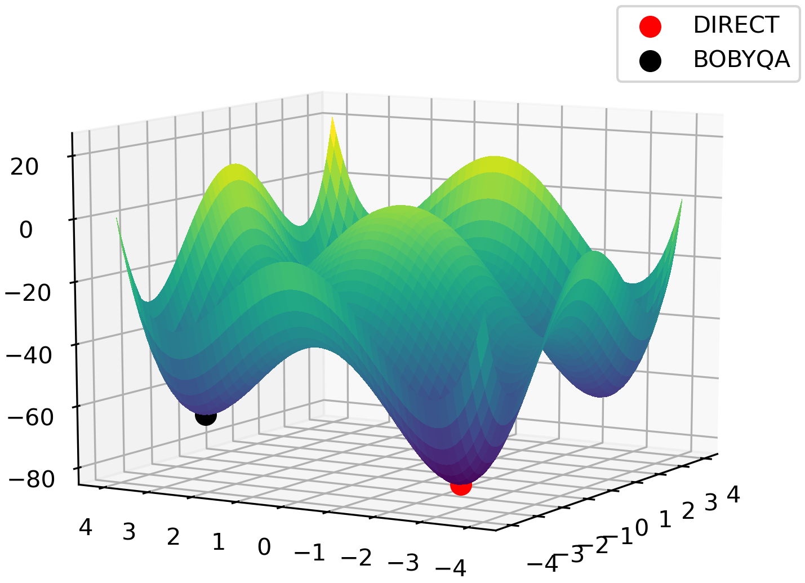

.. _tutorial:

Global optimization
==================================================

.. note::
    Unfortunately, some of NLopt's global optimizers (MLSL, ISRES, STOGO, ESCH) do not seem to respect any convergence criteria besides the total number 
    of function evaluations given by the *maxeval* parameter or an objective value *stopval*. In simplenlopt, *maxeval* is by default set to 1000 * problem dimension 
    for gradient based solvers and 10000 * problem dimension for derivative free solvers. 

In contrast to local optimization algorithms, global optimization algorithms perform a search over a bounded region and try to find the
the global minimum of the function in this region. As an example consider the two-dimensional 
Styblinski-Tang function which has four local minima, one of which is the global optimum:

.. math::

    f(x, y) = \frac{1}{2} \cdot (x^4 - 16x^2 + 5x + y^4 - 16y^2 + 5y)

The classic DIviding RECTangles algorithm (DIRECT) is a suitable candiate for problems like this 
with a low number of local minima. We will compare the result of the global solver DIRECT with the local solver BOBYQA, the default
optimizer in simplenlopt for gradient-free local optimization, initialized at (0, 0).

.. code-block:: python

    import numpy as np
    import simplenlopt
    import matplotlib.pyplot as plt
    from matplotlib import cm

    def styblinski_tang(p):
        x, y = p
        return 0.5 * (x**4 - 16 * x**2 + 5 * x + y**4 - 16 * y**2 + 5 * y)

    xgrid = np.linspace(-4, 4, 100)
    ygrid = np.linspace(-4, 4, 100)

    X, Y = np.meshgrid(xgrid, ygrid)
    Z = 0.5 * (X**4 - 16 * X**2 + 5 * X + Y**4 - 16 * Y**2 + 5 * Y)

    fig, ax = plt.subplots(subplot_kw={"projection": "3d"})
    ax.plot_surface(X, Y, Z, linewidth = 0, cmap = cm.viridis, antialiased=False)

    bounds = [(-4., 4.), (-4., 4.)]
    res_direct = simplenlopt.direct(styblinski_tang, bounds)
    ax.scatter(res_direct.x[0], res_direct.x[1], res_direct.fun, c='r', s = 70, label='DIRECT')

    x0 = np.array([0., 0.])
    res_bobyqa = simplenlopt.minimize(styblinski_tang, x0)
    ax.scatter(res_bobyqa.x[0], res_bobyqa.x[1], res_bobyqa.fun, c='k', s = 70, label='BOBYQA')
    ax.view_init(11, -150)
    ax.legend()

    plt.show()
      

We see that BOBYQA converged to a local minimum but DIRECT was able to find the global minimum. 